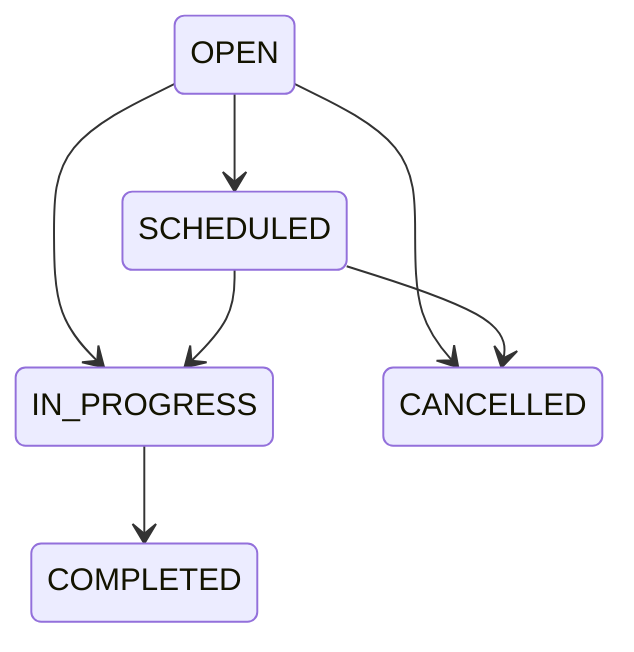

# Maintenance work orders — Batch 11

A work order has organization/vehicle ownership, a tenant-unique WO-000001 number, optional same-vehicle schedule/defect/trip context, type, priority, description, provider text, server timestamps, version, odometer readings, work performed and explicit downtime fields. Models live in maintenance_models.py; migration 0009 owns constraints/RLS/triggers.

Types: PREVENTIVE, REPAIR, INSPECTION, DEFECT_RESPONSE, OTHER. Priorities: LOW, NORMAL, HIGH, CRITICAL. Provider is plain text; no vendor or inventory suite.

COMPLETED/CANCELLED are terminal. Active work cannot be cancelled: record the actual service outcome and complete it. There is no generic status PATCH, reopen or completed-service correction endpoint. Batch 9 trip adjustments are deliberately not extended to maintenance.

Creation and each action require the relevant server permission and Idempotency-Key UUID. Actions also require expected_version. Stale/invalid transitions return 409. Organization write locking serializes numbering, costs, downtime and receipts. A committed duplicate key with matching request returns its original result; altered content conflicts. Authorization is checked before replay. Work, vehicle, schedule, defect, audit and receipt updates commit together.

Scheduled time is timezone-aware. Completion requires work performed and a decimal odometer at least the current trusted maximum. The server supplies start/completion/downtime timestamps. Source references are tenant- and vehicle-validated. A defect must first be reviewed; one work order may reference that defect. Completed work resolves the linked defect and preserves its original description and evidence.

Costs and private evidence are append-only, and new attachments/costs are rejected after closure. New cost/evidence parents are also guarded in PostgreSQL. Maintenance events form immutable history separate from platform audit. No cost automatically becomes a trip expense.

Owner access: Fleet → vehicle detail → Maintenance → maintenance list/work detail. Existing navigation is unchanged. Lists offer attention/upcoming/open/history views. Work detail uses existing cards/forms, status badges, cost/evidence sections and timeline.

API prefix /api/v1: maintenance/work-orders; maintenance/work-orders/{id}; explicit /schedule, /start, /complete, /cancel; /cost-items and /evidence. Closed-history correction, inventory, purchasing and accounting are deferred.
