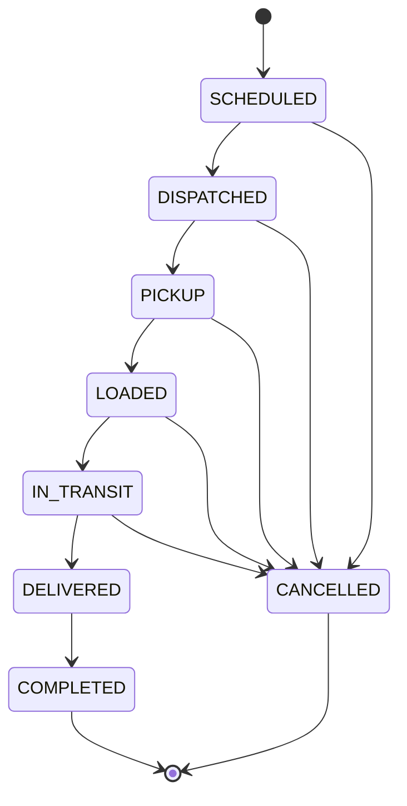

# Trip lifecycle — Batch 4

Batch 9 permits separate financial adjustment events on completed trips. It does not reopen or edit the Trip, milestones, POD or operational fields. See [CLOSED-TRIP-ADJUSTMENTS.md](CLOSED-TRIP-ADJUSTMENTS.md).

Batch 5 extension: the high-level lifecycle below is retained, but bare `deliver` commands now return 409. Delivery requires evidence-backed POD submission, and new trips require POD review before completion. Failed attempts block progress until explicit operator retry authorization. See [DELIVERY-EVIDENCE.md](DELIVERY-EVIDENCE.md) for the current contract, retained attempt history and legacy-trip handling. The Batch 4 transition table below is historical where it refers to `deliver`.

This document defines the implemented Batch 4 workflow. It supersedes earlier **planned** trip-state terminology for this batch. The current user specification resolves Phase 0's pickup/loading milestone ambiguity. There is no DRAFT state.

## Owner-facing lifecycle

Every trip starts SCHEDULED with separate TRIP_CREATED and SCHEDULED milestones. State, detailed milestone, version, assignment and audit changes are transactional. A database trigger independently validates the state projection and permitted progression, and protects closed records.

## Valid detailed transitions and driver action mapping

| Before | API action / endpoint | Events recorded, in order | Owner status after | Driver label / authorization |
| --- | --- | --- | --- | --- |
| SCHEDULED | `dispatch` | DISPATCHED | DISPATCHED | Operator only: Dispatch trip |
| DISPATCHED | `start_pickup` | EN_ROUTE_TO_PICKUP | PICKUP | Start / en route to pickup |
| EN_ROUTE_TO_PICKUP | `arrive_pickup` | ARRIVED_PICKUP | PICKUP | Arrived at pickup |
| ARRIVED_PICKUP | `start_loading` | LOADING_STARTED | PICKUP | Start loading |
| LOADING_STARTED | `finish_loading` | LOADING_COMPLETED | LOADED | Loading complete |
| LOADING_COMPLETED | `depart_pickup` | DEPARTED_PICKUP, EN_ROUTE_TO_DELIVERY | IN_TRANSIT | Depart pickup |
| EN_ROUTE_TO_DELIVERY | `arrive_delivery` | ARRIVED_DELIVERY | IN_TRANSIT | Arrived at delivery |
| ARRIVED_DELIVERY | `start_unloading` | UNLOADING_STARTED | IN_TRANSIT | Start unloading |
| UNLOADING_STARTED | `finish_unloading` | UNLOADING_COMPLETED | IN_TRANSIT | Unloading complete |
| UNLOADING_COMPLETED | `deliver` | DELIVERED | DELIVERED | Mark delivered |
| DELIVERED | `/complete`, `closeout_reviewed: true` | COMPLETED | COMPLETED | Operator only: Complete trip |
| Any pre-delivery nonterminal milestone | `/cancel`, reason required | CANCELLED | CANCELLED | Operator only: Cancel trip |

Departure intentionally records both departure and beginning the delivery leg in one transaction. Both milestones exist independently with ordered event numbers and server timestamps; DEPARTED_PICKUP is not a separately paused current state. This implements the requested golden flow's **Depart Pickup → Arrived Delivery** interaction without inventing an extra driver confirmation. Loading-start and unloading-start capture are mandatory; no other steps are skipped.

Only allowlisted action keys are accepted. The server returns the permitted next action and human label. Arbitrary status strings, client actor/source values and client event timestamps are rejected. Drivers cannot dispatch, assign/reassign, edit operator fields, cancel or complete trips.

## Delivered versus Completed

DELIVERED confirms the shipment reached its destination and operational delivery was confirmed after unloading. It has no completion timestamp and is awaiting operator review. Resources remain operationally reserved until closeout.

COMPLETED requires a permitted operator, a delivered trip and explicit acknowledgement that required trip details and milestone history were reviewed. It records `completed_at` and closes the current trip assignment. Ordinary edits, notes, assignment changes, transitions and cancellation are thereafter prohibited, including at the database layer. No administrative corrections are implemented.

Neither state recognizes revenue, creates an invoice, records payment, proves regulatory compliance or captures photo/signature POD.

## Invalid transitions

| Attempt | Result |
| --- | --- |
| SCHEDULED → DELIVERED | Rejected |
| SCHEDULED → COMPLETED | Rejected |
| DISPATCHED → COMPLETED | Rejected |
| ARRIVED_PICKUP → COMPLETED | Rejected |
| CANCELLED → DISPATCHED | Rejected; cancellation is terminal |
| COMPLETED → IN_TRANSIT | Rejected; completion is terminal |
| Loading-start or unloading-start skip | Rejected |
| Repeated transition with stale version | Rejected |
| Driver dispatch/cancel/complete or another driver's transition | Rejected |

Validly shaped but out-of-order actions return 409; unsupported action/status fields return 422; missing capability returns 403; inaccessible trip IDs return 404. Every mutation requires `expected_version`. A stale UI receives a refresh instruction rather than silently overwriting newer work. Retrying after an uncertain response requires reloading the current trip/version. Offline submissions and generic idempotency-key processing are not implemented.

## Milestone semantics and immutability

`TripMilestone` contains organization/trip IDs, a strictly ordered per-trip event number, type, occurred/recorded times, actor, source, optional notes and allowlisted metadata. Times come from PostgreSQL's clock at recording; they represent the actor's contemporaneous confirmation, not observed GPS movement or independently verified delivery evidence. No backdated or offline milestone editing exists.

Sources are derived server-side: DRIVER_APP for own-trip actions, DISPATCHER_WEB for the Dispatcher role, OWNER_WEB for owner/admin/manager actions. SYSTEM is reserved but not used to fabricate events. History has no update/delete API or RLS policy, and a database trigger rejects mutation even by the migration owner. Audit logs remain a separate immutable table recording business/security mutations and safe change metadata.

## Assignment and editing rules

- One primary driver and one vehicle are assigned together, or both remain unassigned. Dispatch requires both and active, same-tenant customer/driver/vehicle references.
- `TripAssignment` is separate from Batch 3 `VehicleDriverAssignment`. Trip creation/progression never edits fleet-master assignment history or invents fleet-master IN_TRANSIT status.
- Assign/reassign only while SCHEDULED or DISPATCHED, before pickup travel starts. Reassignment closes the old row and creates a new current row; it never erases history. Completion/cancellation closes the current row while keeping trip summary references.
- Operational metadata changes only while SCHEDULED. Operator notes have a separate endpoint while nonterminal. Cancellation and completion freeze all ordinary fields.
- Customer/vehicle deactivation and non-active driver employment are blocked while referenced by open trips. This prevents silently invalidating dispatch work.
- Driver access requires an active domain profile linked to the authenticated user, in the active organization. Own active and history lists remain filtered to that driver's current trip reference; reassigned-away trips are no longer readable by the previous driver.

## Conflict detection — exact V1 behavior

The reservation is a half-open interval `[scheduled_pickup_at, scheduled_delivery_at)`. With no delivery time, the end is **pickup + 24 hours**. Overlap on either driver or vehicle blocks create, assign/reassign or schedule changes. Back-to-back intervals can be scheduled. At dispatch, any other dispatched-through-delivered trip on either resource blocks dispatch even when nominal scheduled windows do not overlap. Database partial unique indexes independently enforce one operationally active trip per vehicle and driver. Writes share the existing organization lock to prevent check/write races.

This is deliberately not a full scheduling engine. It does not estimate travel, loading duration, turnaround, rest periods, overtime, actual late arrival, multi-day capacity, legal driving hours or fleet-master preferred-pair suitability. Missing delivery times may over-reserve or under-reserve real work; operators must supply realistic schedules and close/cancel unfinished trips. No automated optimization or GPS is implied.

## Dispatch Board views

Today uses the organization's local pickup date; Upcoming shows SCHEDULED trips starting tomorrow or later. Active contains DISPATCHED/PICKUP/LOADED/IN_TRANSIT. Delivered / Completed groups those two distinct states. Cancelled is separate; All trips supports recovery of past scheduled work. Search covers trip number, customer, stop names and references. Status, customer, vehicle, driver and inclusive date filters combine with allowlisted sorting and bounded pagination. Date filters use the organization timezone; displayed/form times use the device timezone and are sent as explicit UTC instants.
